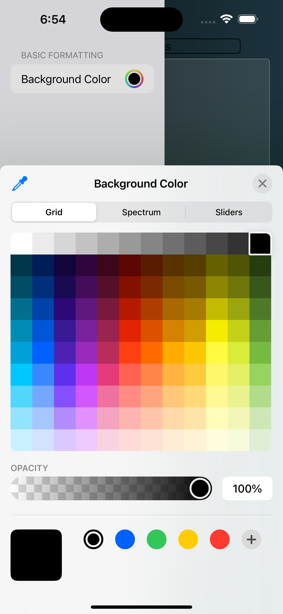
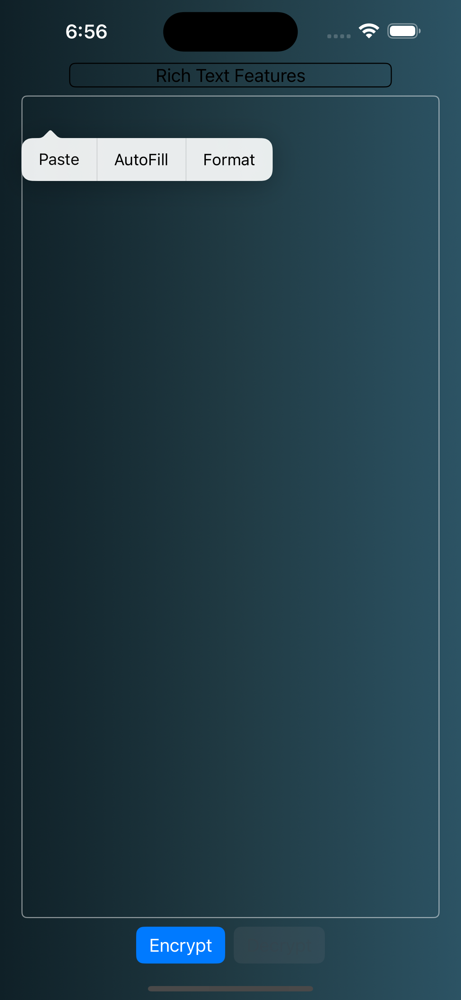
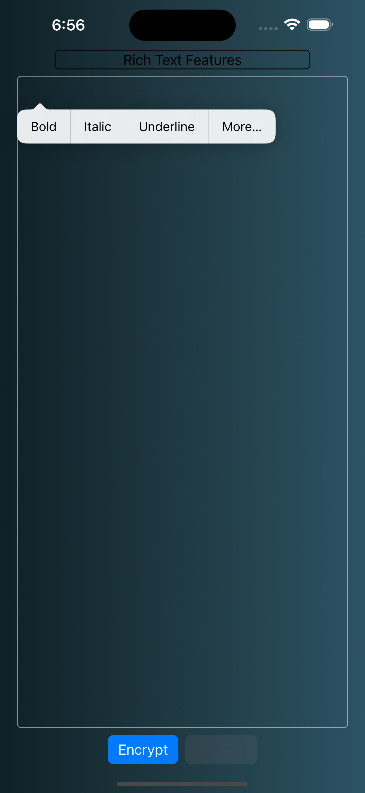
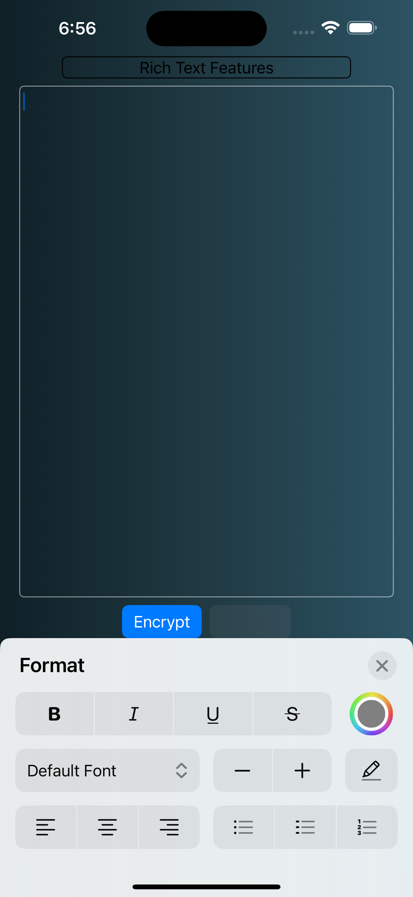
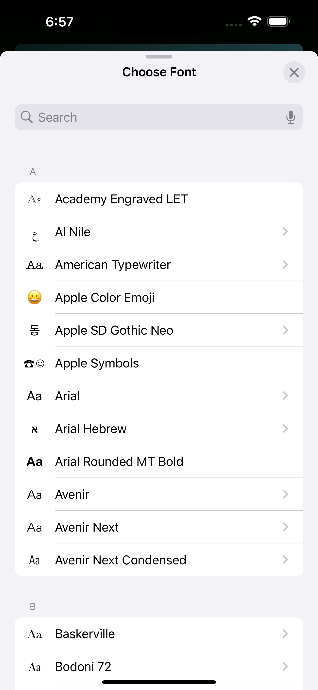

<html>
  

     
    <h1>ghostmemo</h1>
    
user friendly encryption for ios devices

  

  

    <h2 align="center">About</h2>
    

      	ghostmemo is a an application that intends to offer individuals easy access to secure encrpytion that is both user friendly and reliable. 
				No network connection is required, no account creation or data collection -- just you and your data, locked away however you see fit.
        Many, if not most, individuals are not prepared to install a full suite of pgp tools on their devices - ghostmemo aims to fill that gap with a               simple tool that anyone can understand and use confidently
				if you lose or delete your encryption keys, any encrypted notes will be lost permanently
    

  

  

    <h2 align="center">Get Started</h2>
    

      It takes three things to get ghostmemo up and running:
      <ol>
        <li>iPhone (iOS 18.0+)</li>
        <li>Network Connection To Download</li>
        <li>Encryption Keys (Generated In-App)</li>
      </ol>
    Okay, I admit you likely need a few other minor things. 
    <li>ghostmemo requires Face ID to generate/use encryption keys - this is an added layer security for an app designed to be easy to use and simple to understand.</li>
    <li>When you launch the app, it will request acceess to Face ID - if you do not approve this, it will not allow you to encrypt any of your memos, as 	you would be unable to decrypt them without user authentication and the private key</li>
	Once you've used Face ID to enter the app, you should navigate to the account page (the top-left icon) and hit "Generate Encryption Keys"
	With your keys generated successfully, the rest of the heavy lifting is done by ghostmemo itself. The home screen allows for you to create/edit 	new memos and their editor has simple "encrypt" and "decrypt" buttons. It feels important to note that biometric authenticaton is not required to 	encrypt, but is required to decrypt. 
	  
From here on out, everything should sort of be on auto-pilot. You should never <b>have</b> to generate new encryption keys, and doing so will make 	any previously encrypted memos unreadable. <em>However</em>, rotating encryption keys several times a year (or more) is a good habit.
    

  

  

    <h2 align="center">Rich Text Features</h2>
    

      ghostmemo's text editor offers multiple layers of customization. In the toolbar, the pen icon allows users to alter the background color of the editor quickly. 
	  

		 
	  

Additionally, the iOS text formatting keyboard can also be accessed by navigating down through the submenu as shown in the images below. This allows for a rich set of features, such as font selection, text formatting and styling, among other features. 
	  
By selecting "format" in the initial context menu and then selecting "more", you are able to bring up a more fully featured keyboard to style your text. ghostmemo stores text in a form of attributed string, allowing your styling and formatting to remain even after being passed through multiple layers of encryption. 

  &nbsp;&nbsp;&nbsp;
 &nbsp;&nbsp;&nbsp;
 &nbsp;&nbsp;&nbsp;
 &nbsp;&nbsp;&nbsp;

    

  

  

	  <h3>Privacy Policy</h3>
	  

		  ghostmemo does not collect any user data or access the internet in any way. ghostmemo will never gather, monitor, or distribute user data.
	  

  

</html>
